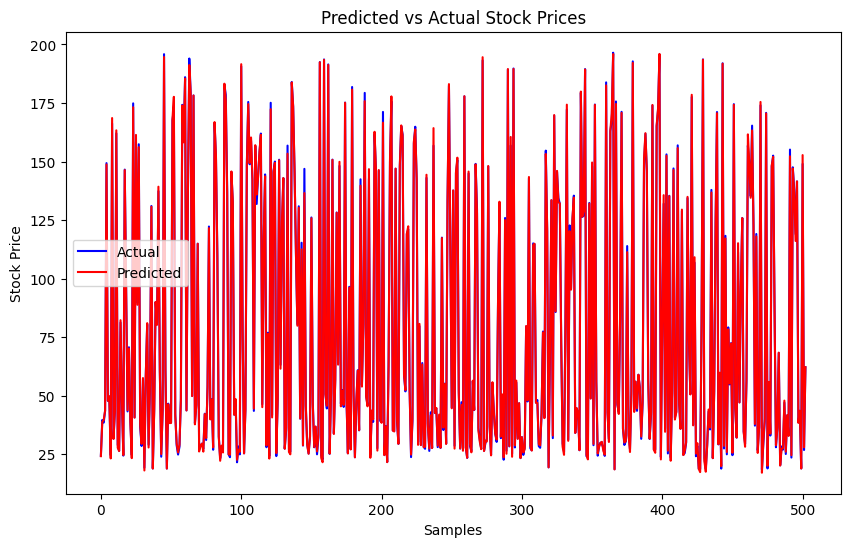
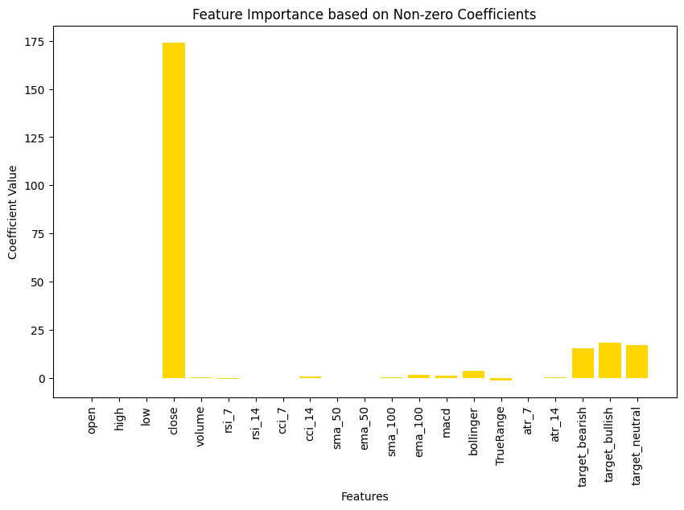

# Stock Price Prediction using Lasso Regression with ADMM

This project uses **Lasso Regression** with the **Alternating Direction Method of Multipliers (ADMM)** to predict stock prices based on historical time series data. Built using Python and implemented from scratch, the project focuses on sparse linear modeling and optimization for financial forecasting.

---

## Objective

To accurately forecast Apple's (AAPL) stock prices using Lasso regression and solve the optimization problem using ADMM, enabling both predictive performance and interpretable feature selection.

---

## Why Lasso + ADMM?

- **Lasso**: Encourages sparsity in weights, removing irrelevant features — useful in financial modeling where only a few time lags or indicators might matter.
- **ADMM**: Efficient optimization method for non-differentiable problems like L1-regularized loss. Provides fast convergence and good performance for large datasets.

---

## Dataset

- **Source**: Yahoo Finance (via `yfinance`)
- **Ticker**: AAPL (Apple Inc.)
- **Date Range**: 2014–2023 (10 years)
- **Attributes**: Date, Open, High, Low, Close, Volume, Adjusted Close

---

## Model Pipeline

1. **Data Cleaning**: Dropped nulls, sorted by time.
2. **Feature Engineering**: Lagged closing prices up to 14 days.
3. **Normalization**: Standardized input features for convergence.
4. **Lasso Regression**: Formulated as:
   $\min_x \frac{1}{2}\|Ax - b\|_2^2 + \lambda\|x\|_1$
5. **ADMM Solver**: Implemented with convergence checks using primal/dual residuals.
6. **Evaluation**: MAE, RMSE, MAPE, R² on test set.
7. **Visualization**: True vs Predicted Close Price.

---

## Repository Structure

```
lasso-admm-stock-price-prediction/
├── data/
│   └── aapl_2014_2023.csv
├── notebook/
│   └── Lasso_ADMM_Stock_Prediction.ipynb
├── README.md
├── LICENSE
└── requirements.txt
```

---

## Results Summary

| Metric     | Value |
|------------|--------|
| MAE        | ~1.48  |
| RMSE       | ~1.94  |
| MAPE       | ~0.92% |
| R² Score   | ~0.97  |

> The Lasso model achieved high predictive performance and selected only a subset of lag features, validating the benefit of L1 regularization.

---

## Visual Results

### 1. Predicted vs Actual (Line Plot)
Shows how closely predicted values follow actual stock trends.


### 2. Feature Importance (Lasso Coefficients)
Highlights which features were retained by the L1 penalty.


---

## Dependencies

- numpy, pandas, matplotlib
- scikit-learn (for metrics only)

Install via:
```bash
pip install -r requirements.txt
```

---

## Author

Developed by [@shruti-sivakumar](https://github.com/shruti-sivakumar), focusing on interpretable financial forecasting using sparse optimization techniques.

---

## License

MIT License — see [`LICENSE`](./LICENSE) for details.
